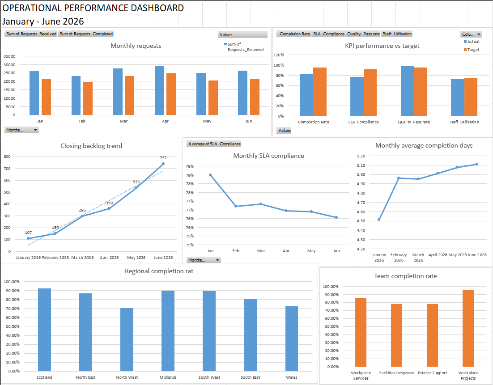
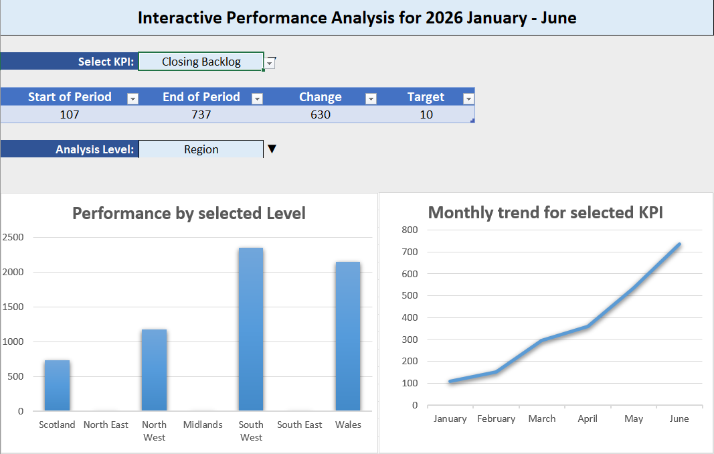

# Operational_Performance_Analysis
Operational performance analysis project demonstrating Excel data cleaning, KPI analysis, data consolidation, PivotTables, advanced formulas, dynamic arrays, visualisation and management reporting.

## Project Overview

The workbook follows an end-to-end analytical workflow:

**Raw data → Cleaning → Validation → KPI calculations → Regional/team/monthly analysis → Visualisation → Interactive analysis → Recommendations**

The project combines operational, staffing, incident, regional reference and action data into a single reporting solution. Excel Tables, lookup functions, conditional logic, aggregation functions, dynamic arrays, PivotTables and charts are used to transform the source data into reusable analysis and management reporting.

The workbook also includes dedicated data-quality checks to identify missing values, inconsistent text, duplicate IDs, invalid numerical values and violations of operational business rules.

# Operational_Performance_Analysis

Operational performance analysis project demonstrating Excel data cleaning, KPI analysis, data consolidation, PivotTables, advanced formulas, dynamic arrays, visualisation and management reporting.

## Workbook Preview

### Dashboard

The dashboard provides a static management overview of operational performance, including KPI performance against targets, monthly trends, regional performance and team performance.

### Interactive Analysis

The interactive analysis allows users to select a KPI and investigate its performance over time and across regions or teams.

## Key Findings

Analysis of operational performance from January to June 2026 identified a clear deterioration in workload management and service performance.

### 1. Closing backlog increased significantly

* Closing backlog increased from **107 in January to 737 in June**.
* This represents an increase of **630 items**.
* The backlog increased consistently throughout the reporting period, indicating that completed work was not keeping pace with workload.

### 2. Average completion time deteriorated

* Average completion time increased from **4.51 days in January to 5.11 days in June**.
* This represents an increase of **0.60 days**.
* The increase in completion time coincided with the growth in closing backlog, suggesting increasing pressure on the operation's ability to complete work promptly.

### 3. SLA compliance declined

* SLA compliance decreased from **78.51% in January to 76.07% in June**.
* This represents a decline of **2.44 percentage points**.
* Performance remained below the **92% target** throughout the reporting period and deteriorated further towards June.

### 4. Completion rate declined

* Completion rate decreased from **83.06% in January to 82.10% in June**.
* This represents a decline of **0.96 percentage points**.
* Although the change was relatively small, the decline occurred alongside increasing completion times and a growing backlog.

### Positive finding: Quality remained strong

* Quality Pass Rate remained consistently high, changing only slightly from **98.26% in January to 98.11% in June**.
* This indicates that the deterioration in completion and workload measures was **not accompanied by a comparable deterioration in quality**.

Management Recommendations

### 1. Review and replicate high-performing team practices

Workplace Projects achieved the strongest team performance, with a 94.98% completion rate, 87.42% SLA compliance and zero closing backlog, despite staff utilisation of 72.77%. In comparison, Estates Support recorded 78.10% completion, 70.26% SLA compliance and a 1,055-item closing backlog, despite having the highest utilisation at 73.63%.

This suggests that utilisation alone does not explain differences in performance. Management should review the workflows, prioritisation methods and working practices used by higher-performing teams and assess whether effective approaches can be applied elsewhere.

### 2. Prioritise North West and Wales for operational review

North West recorded the lowest regional completion rate at 70.63%, while Wales recorded the lowest SLA compliance at 69.33%. Both regions also had substantial closing backlogs of 1,179 and 2,148 respectively.

Management should prioritise these regions for a more detailed review of workload, workflow bottlenecks and capacity allocation. The review should identify the underlying causes before additional resources or other interventions are introduced.

### 3. Improve throughput while protecting quality

Overall completion rate was 83.1%, below the 95% target, while SLA compliance was 76.8%, below the 92% target. Closing backlog increased from 107 in January to 737 in June, while average completion time increased from 4.51 to 5.11 days.

However, quality remained consistently strong at approximately 98%, above the 95% target. Management should therefore focus on improving throughput, timeliness and backlog management while maintaining existing quality controls.

### Overall conclusion

The analysis indicates that the primary performance challenge is workload management and throughput rather than quality or utilisation alone. Performance varies considerably between teams and regions despite relatively similar utilisation levels. Recommended next steps are to understand differences in working practices and capacity allocation, prioritise underperforming regions, and reduce backlog without compromising the strong quality performance already being achieved.

## Data

The dataset used in this project is **synthetic data generated in Python** using `pandas` and `numpy`. It was created specifically to simulate a realistic operational performance environment and contains deliberately introduced data-quality issues for the cleaning and validation stages of the analysis.

The dataset covers **January to June 2026** and includes:

* Daily operational performance across **7 regions and 4 teams**
* Monthly staffing and capacity data
* Operational incidents and severity information
* Regional reference data
* Actions and improvement activity
* KPI definitions and target values

Six CSV files were generated:

| File                       | Description                      |
| -------------------------- | -------------------------------- |
| `01_operations_data.csv`   | Daily operational performance    |
| `02_kpi_targets.csv`       | KPI definitions and targets      |
| `03_staffing_capacity.csv` | Monthly staffing and capacity    |
| `04_incident_log.csv`      | Operational incidents            |
| `05_region_reference.csv`  | Regional reference data          |
| `06_action_tracker.csv`    | Actions and improvement activity |

The generator intentionally introduces issues such as **inconsistent whitespace, inconsistent text values and missing values**. These provide realistic data-cleaning and validation scenarios while keeping the underlying dataset reproducible.

The operational data also follows defined business rules:

**Opening Backlog + Requests Received = Total Workload**

**Total Workload − Requests Completed = Closing Backlog**

The original synthetic data is retained as the source data, with cleaning and validation performed within the Excel workflow.
